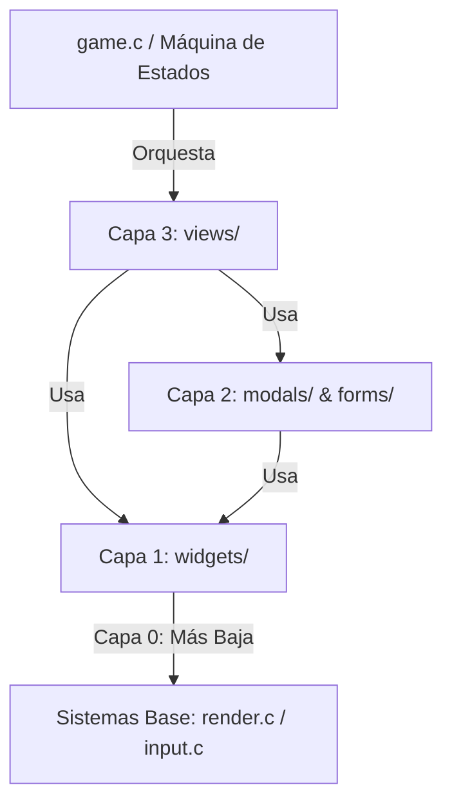

# Arquitectura de Software - OveNotesDS UI

Este documento describe la estructura y diseño del sistema de interfaz de usuario (UI) de OveNotesDS, después de su refactorización a una arquitectura modular por capas. Está pensado para que cualquier desarrollador pueda entender rápidamente dónde se encuentra cada elemento y cómo interactúan las piezas del software.

---

## 📐 Reglas de Capas y Dependencias (Dirección del Flujo)

Para evitar dependencias circulares y mantener el código desacoplado y mantenible, la UI se organiza en **4 capas estrictas**. Un archivo de una capa inferior **nunca** debe incluir `#include` ni conocer la existencia de elementos de una capa superior.



### 📋 Reglas detalladas:
1. **`widgets/` (Capa 1):** Es la capa más baja de UI. No conoce nada de `modals/`, `forms/` ni `views/`. Solo depende de las primitivas gráficas (`render.c`) y de entrada (`input.c`).
2. **`modals/` y `forms/` (Capa 2):** Pueden usar los `widgets/` comunes para renderizar botones, teclados o sliders, pero no saben nada de las `views/` principales ni del estado global del flujo del juego.
3. **`views/` (Capa 3):** Es la capa más alta de la interfaz. Coordina la barra de herramientas, los paneles laterales, los modales abiertos y compone la pantalla completa.
4. **Coordinador del Juego (`game.c`):** La máquina de estados del juego se comunica **únicamente** con la capa de `views/` a través de funciones exportadas (`view_*_show()`). Nunca interactúa con widgets o modales de forma directa.

---

## 📂 Directorios y Correspondencia de Archivos

A continuación se detalla a qué corresponde cada archivo dentro del directorio `source/ui/`:

### 1. 🖥️ Capa de Vistas (`source/ui/views/`)
Contiene las pantallas principales del juego. Cada una implementa su propio bucle de pintado y actualización de pantalla.

- **`view_canvas.c/.h`:** Gestiona el lienzo de dibujo principal. Dibuja los botones de Deshacer/Rehacer (Undo/Redo) en la esquina superior izquierda si la UI está visible, y compone el área de trabajo en tiempo real.
- **`view_menu.c/.h`:** Administra el menú de inicio (pantalla de bienvenida), el selector visual de temas (colores de la interfaz) y los botones de acceso a la Galería y Wi-Fi.
- **`view_gallery.c/.h`:** Controla el visor de notas guardadas en la tarjeta SD, renderizando el carrusel de previsualizaciones y la barra superior de acciones.
- **`view_wizard.c/.h`:** Gestiona el asistente de emparejamiento por red, mostrando el código de sincronización y el estado de conexión inalámbrica.

### 2. 💬 Capa de Modales (`source/ui/modals/`)
Cuadros de diálogo superpuestos que solicitan confirmación o permiten modificar configuraciones temporales.

- **`modal_tools.c/.h`:** Cuadro de selección de herramientas activas: Pincel, Borrador, Relleno de pintura y guías de perspectiva técnica.
- **`modal_colors.c/.h`:** Modal de paleta de colores. Muestra colores predefinidos, ranuras personalizadas y controles deslizantes de tono, saturación y valor (HSV).
- **`modal_bg.c/.h`:** Selección de cuadrículas y patrones de fondo del lienzo (puntos, líneas, rejillas isométrica/perspectiva).
- **`modal_brush.c/.h`:** Modal de ajuste de tamaño de pincel y goma de borrar con previsualización dinámica.
- **`modal_confirm.c/.h`:** Diálogo estándar de confirmación (ej: borrar lienzo, salir sin guardar).
- **`modal_language.c/.h`:** Modal de cambio de idioma global de la aplicación.
  > [!IMPORTANT]
  > Al ser el único modal que afecta un estado global del sistema (el idioma de toda la app), este modal **únicamente** debe ser invocado por la máquina de estados en `game.c` o por el coordinador central `ui.c`. Ninguna otra vista o submódulo de interfaz debe llamarlo directamente, evitando así romper el aislamiento de capas por la puerta de atrás.

### 3. 📝 Capa de Formularios (`source/ui/forms/`)
Vistas de entrada de texto e interacción estructurada.

- **`form_wifi.c/.h`:** Formulario para introducir y seleccionar las ranuras de conexión Wi-Fi de la consola Nintendo DS.
- **`form_rename.c/.h`:** Formulario de cambio de nombre para guardar archivos de notas de forma personalizada.

### 4. 🧱 Capa de Widgets (`source/ui/widgets/`)
Elementos gráficos interactivos de bajo nivel y reutilizables.

- **`keyboard.c/.h`:** Teclado interactivo en pantalla con soporte para configuraciones QWERTY y AZERTY (idioma francés).
- **`sidebar.c/.h`:** Barra lateral derecha para el control y orden de capas (añadir, eliminar, visibilidad y opacidad de capas).
- **`toolbar.c/.h`:** Barra de herramientas inferior con los botones rápidos de selección de color, herramientas, ajustes de lienzo y menú.
- **`widget_buttons.c/.h`:** Componente base para dibujar botones estilizados con textos, iconos y bordes adaptados al tema de color actual.

### 5. 🌍 Localización y Coordinación Base
- **`ui.c/.h`:** Coordinador central de la interfaz de usuario. Almacena el estado global de ventanas (`g_app_state.ui`) y gestiona las transiciones entre modales.
- **`ui_compat.h`:** Archivo de macros de compatibilidad. Traduce variables legadas cortas a la jerarquía moderna estructurada dentro de `g_app_state` sin romper código histórico.
- **`language_en.c`, `language_es.c`, `language_fr.c` / `language.h`:** Cadenas de traducción internacional y mapeo de fuentes.
  > [!NOTE]
  > *Fase de transición:* Actualmente estos archivos residen en la raíz de `source/ui/` por razones de compatibilidad histórica, pero está planificado extraerlos a un directorio propio de localización `source/ui/i18n/` en la **Fase 2** de la refactorización para mantener la raíz limpia.

---

## 🛑 Fuera de Scope: ¿Qué NO hace `ui.c`?

Para mantener la cohesión y evitar que el coordinador central se convierta en un "archivo cajón de sastre" (God Object), se definen explícitamente las siguientes responsabilidades fuera de su alcance:
* ❌ **Lógica de Red y Sockets:** `ui.c` no sabe cómo enviar paquetes HTTP ni inicializar la pila Wi-Fi de la consola. Toda esta responsabilidad reside en `source/systems/net.c`.
* ❌ **Máquina de Estados de Flujo:** La UI no decide cuándo pasar de la pantalla de bienvenida al modo dibujo o a la galería tras desconectarse. Esa responsabilidad de control pertenece a la máquina de estados en `source/systems/game.c`.
* ❌ **Persistencia y Acceso a SD:** El cargado, guardado y manipulación de archivos PNG en la tarjeta SD de la consola pertenece a `source/systems/io.c`.
* ❌ **Gestión de Historial de Dibujo:** Las operaciones de deshacer/rehacer y mezcla de capas se orquestan en `source/systems/render.c`.

---

## 🛠️ Cómo compilar y añadir una nueva funcionalidad

1. **Añadir un nuevo Modal/Formulario/Widget:**
   Créalo en su carpeta respectiva. Ej: `source/ui/modals/modal_export.c`.
2. **Actualizar el Makefile:**
   Los archivos se agregan automáticamente al compilar porque el Makefile escanea los subdirectorios dentro de `source/ui/` de forma recursiva:
   ```make
   SOURCES := source source/systems source/ui source/ui/widgets source/ui/modals source/ui/forms source/ui/views source/vendor
   ```
3. **Respetar la regla de `#include`:**
   Si creas un archivo en `widgets/`, asegúrate de **no** importar nada que esté dentro de `views/` ni `modals/`. Esto garantiza que los componentes sigan siendo testeables de forma aislada.
