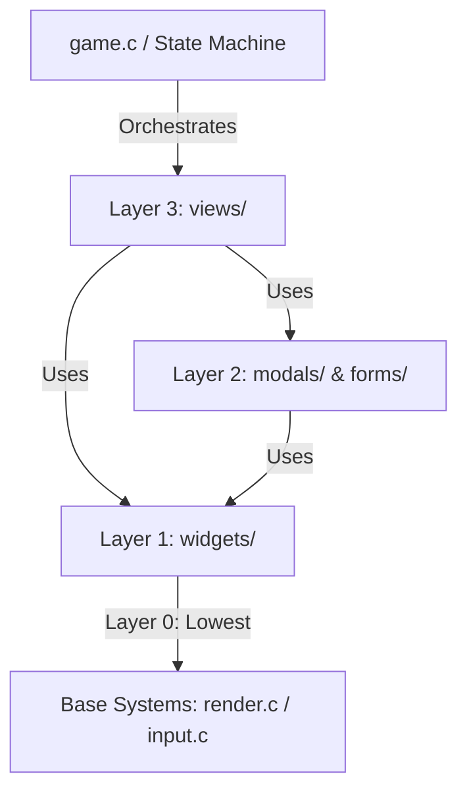

# Software Architecture - OveNotesDS UI

This document describes the structure and design of the OveNotesDS user interface (UI) system after its refactoring to a layered modular architecture. It is designed to help any developer quickly understand where each element is located and how the software components interact.

---

## 📐 Layer Rules & Dependencies (Flow Direction)

To avoid circular dependencies and maintain decoupled, clean, and maintainable code, the UI is organized into **4 strict layers**. A file in a lower layer **must never** `#include` or be aware of the existence of any files/elements in a higher layer.



### 📋 Detailed Rules:
1. **`widgets/` (Layer 1):** The lowest UI layer. It has no knowledge of `modals/`, `forms/`, or `views/`. It only depends on graphic primitives (`render.c`) and input systems (`input.c`).
2. **`modals/` and `forms/` (Layer 2):** Can use common `widgets/` to render buttons, keyboards, or sliders, but they know nothing about the main `views/` or the global state of the game flow.
3. **`views/` (Layer 3):** The highest interface layer. It coordinates the toolbar, sidebars, open modals, and composes the overall screen display.
4. **Game Coordinator (`game.c`):** The game state machine communicates **only** with the `views/` layer via exported functions (`view_*_show()`). It never interacts directly with widgets or modals.

---

## 📂 Directories and File Mappings

Below is the file map of the `source/ui/` directory:

### 1. 🖥️ Views Layer (`source/ui/views/`)
Contains the main screens of the application. Each view manages its own drawing and update loop.

- **`view_canvas.c/.h`:** Manages the main drawing board canvas. Draws the Undo/Redo buttons in the top-left corner if the UI is visible, and composes the workspace in real-time.
- **`view_menu.c/.h`:** Manages the start screen (welcome menu), theme selector, and entry buttons for the Gallery and Wi-Fi Wizard.
- **`view_gallery.c/.h`:** Controls the SD card saved notes explorer, rendering the previews carousel and the top action bar.
- **`view_wizard.c/.h`:** Manages the network pairing wizard, displaying the synchronization code and connection status.

### 2. 💬 Modals Layer (`source/ui/modals/`)
Overlay dialogues that prompt for confirmations or modify temporary configuration parameters.

- **`modal_tools.c/.h`:** Tool selection modal: Brush, Eraser, Bucket Fill, and technical perspective guides.
- **`modal_colors.c/.h`:** Color palette selection modal. Displays preset palette colors, custom slots, and Hue/Saturation/Value (HSV) sliders.
- **`modal_bg.c/.h`:** Canvas background pattern and grid selection (dots, lines, isometric/perspective grids).
- **`modal_brush.c/.h`:** Brush and eraser sizing modal with real-time size pre-rendering.
- **`modal_confirm.c/.h`:** Standard confirmation dialogs (e.g., clear canvas, exit drawing without saving).
- **`modal_language.c/.h`:** Application-wide language selector.
  > [!IMPORTANT]
  > Since it is the only modal that alters a global system state (the language for the entire app), this modal **must only** be invoked by the state machine in `game.c` or by the central coordinator `ui.c`. No other view or interface sub-module should invoke it directly, thereby avoiding any backdoor violation of layering constraints.

### 3. 📝 Forms Layer (`source/ui/forms/`)
Dedicated text entry views and structured forms.

- **`form_wifi.c/.h`:** Form to enter and select Nintendo DS Wi-Fi connection slots.
- **`form_rename.c/.h`:** Note rename form for saving files under custom names.

### 4. 🧱 Widgets Layer (`source/ui/widgets/`)
Reusable, low-level interactive UI components.

- **`keyboard.c/.h`:** On-screen virtual keyboard with support for QWERTY and AZERTY layouts (French support).
- **`sidebar.c/.h`:** Right layer panel for controlling drawing layers (add, delete, visibility, and layer opacity).
- **`toolbar.c/.h`:** Bottom toolbar containing quick shortcuts for color, tools, canvas adjustments, and system menus.
- **`widget_buttons.c/.h`:** Base widget to render buttons with text, icons, and borders adapted to the current UI theme color.

### 5. 🌍 Localization Layer (`source/ui/i18n/`)
Translation resource files and local text mappings.
- **`language_en.c`, `language_es.c`, `language_fr.c`** (in `source/ui/i18n/`): Contain translation strings and localization arrays for English, Spanish, and French.
- **`texts.h`** (in `include/`): Declares the text ID enumeration (`TextId`) representing all UI label resources.

### 6. ⚙️ Coordination Base (`source/ui/`)
Core files orchestrating the UI state and compatibility mapping.
- **`ui.c/.h`:** Main user interface manager and coordinator. Keeps track of the open modal state (`g_app_state.ui`) and handles window routing.
- **`ui_compat.h`:** Compatibility macros that map short legacy names to the modern nested properties in `g_app_state` without breaking historic references.

---

## 🛑 Out of Scope: What `ui.c` does NOT do

To maintain strong cohesion and prevent the UI coordinator from becoming a "catch-all" God Object, the following responsibilities are explicitly declared out of its scope:
* ❌ **Network & Socket Logic:** `ui.c` has no knowledge of how to send HTTP packets or initialize the console's Wi-Fi stack. All network operations live in `source/systems/net.c`.
* ❌ **Game State/Flow Machine:** The UI does not decide when to transition from the welcome screen to drawing mode or to the gallery after disconnecting. That control flow lives in `source/systems/game.c`.
* ❌ **Persistence & SD Card Access:** Loading, saving, and managing PNG files on the console's SD card belongs to `source/systems/io.c`.
* ❌ **Drawing History & Canvas Math:** Undo/Redo operations and layer blending calculations are orchestrated in `source/systems/render.c`.

---

## 🛠️ How to Compile & Add New Features

1. **Add a new Modal/Form/Widget:**
   Create it in its corresponding folder (e.g., `source/ui/modals/modal_export.c`).
2. **Update the Makefile:**
   Files are added automatically upon building as the Makefile scans all subdirectories recursively:
   ```make
   SOURCES := source source/systems source/ui source/ui/widgets source/ui/modals source/ui/forms source/ui/views source/vendor
   ```
3. **Adhere to Layering Rules:**
   If you write a widget in `widgets/`, ensure it **never** imports any headers from `views/` or `modals/`. This ensures components remain isolated and testable.
