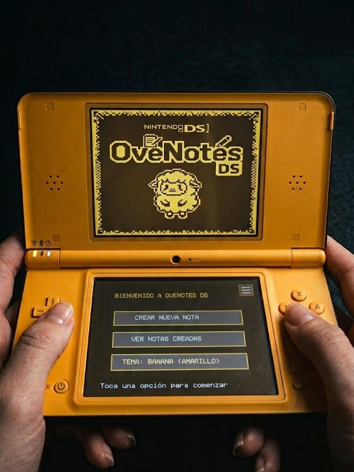
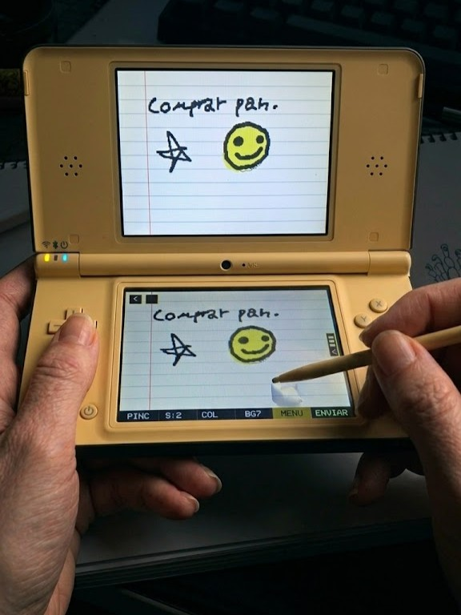
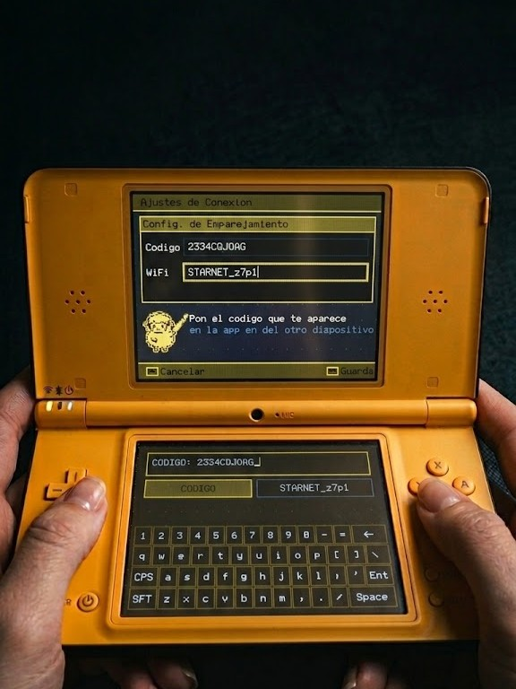
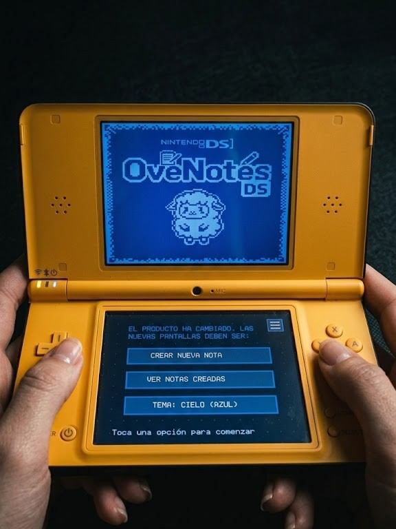
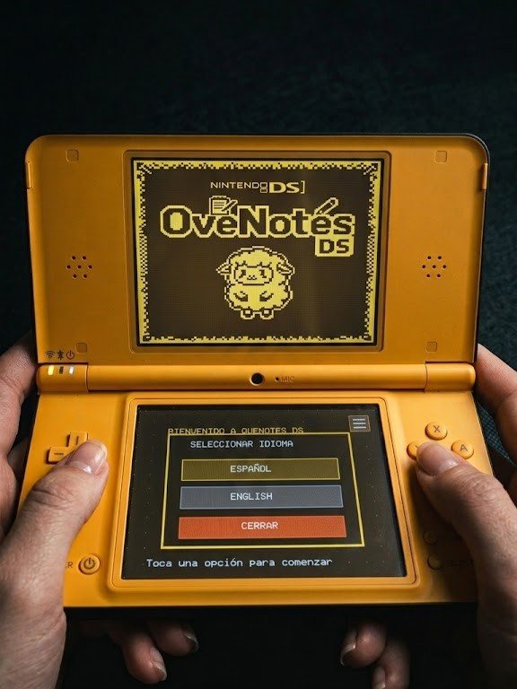
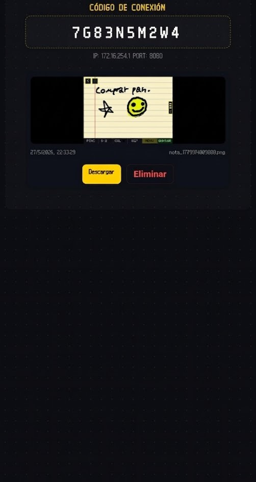

# OveNotesDS

[English](#english) | [Español](#español)

## English

> [!IMPORTANT]
> ### 🚀 Direct Download Links (Latest Version)
> Download the compiled, ready-to-use version for your devices:
> 
> * **🎮 Nintendo DS / DSi (Homebrew ROM):** [Download OveNotesDs.nds](https://github.com/JoelBeja2000/OveNotesDs/releases/latest/download/OveNotesDs.nds)
> * **📱 Android (Mobile App):** [Download OveNotesDS.apk](https://github.com/JoelBeja2000/OveNotesDs/releases/latest/download/OveNotesDS.apk)
> * **💻 Windows (Desktop Executable):** [Download OveNotesDS.exe](https://github.com/JoelBeja2000/OveNotesDs/releases/latest/download/OveNotesDS.exe)

---

This document describes the project structure, main systems, and execution flow of **OveNotesDS**, a Nintendo DS homebrew application built with the **BlocksDS** SDK. Its main purpose is to let the user draw on the touchscreen and upload the result as PNG images to a server using HTTP POST requests (`/api/nueva-nota`).

---

## 🛠️ Development Environment and Tools

*   **SDK**: BlocksDS (Core).
*   **Language**: C (ARM9).
*   **Main libraries**:
    *   `libnds9`: Handles Nintendo DS hardware (screens, VRAM, buttons, touchscreen input).
    *   `libdswifi9` (`dswifi`): Initializes and manages Wi-Fi network connections.
    *   `lodepng`: PNG encoder in C for converting the drawing buffer into compressed PNG data before upload.

---

## 📂 Source Structure (`/source`)

The code is organized in independent modules for game logic, networking, UI and rendering.

### 1. `main.c` (Entry Point)
*   **Function**: Initializes exception handling, sets up the screens, and mounts the SD card with `fatInitDefault()`.
*   **Flow**:
    1. Calls `gameInit()` to configure VRAM and video modes.
    2. If SD mount succeeds, initializes logging with `logInit()` and loads saved configuration with `netLoadConfig()`.
    3. Enters the main loop, running `inputScan()`, `gameUpdate()`, and waiting for vertical sync (`swiWaitForVBlank()`) at 60 FPS.

### 2. `game.c` and `game.h` (Application State Machine)
*   **`GameState` states**:
    *   `STATE_DRAW`: Main drawing screen, showing the canvas and toolbar.
    *   `STATE_WIZARD`: Network setup form for IP, port, and Wi-Fi SSID with an on-screen keyboard.
    *   `STATE_UPLOAD`: Encodes the canvas to PNG in RAM and sends it via HTTP POST over TCP sockets.
*   **`gameUpdate()`**: Processes touchscreen input and dispatches events based on the active state.
*   **Touch handling**: Uses release-based logic to avoid noisy initial ADC coordinates like `0,0` when the stylus first touches the screen.

### 3. `net.c` and `net.h` (Networking and Sockets)
*   **DS vs DSi networking**: Uses `Wifi_InitDefault(WIFI_ATTEMPT_DSI_MODE)` to try DSi mode first. If unavailable, falls back to DS-compatible networks.
*   **`enviarNotaHTTP()`**:
    *   Creates a TCP socket (`AF_INET`, `SOCK_STREAM`).
    *   Connects to the configured remote server.
    *   Builds standard HTTP POST headers (`Content-Type: application/octet-stream`, `Content-Length`).
    *   Sends binary PNG data with non-blocking socket support and `select()` timeouts to avoid freezing the main loop.
*   **Configuration persistence**:
    *   `netLoadConfig()`: Reads `ovenotes_config.txt` from the SD root and parses IP, port, and SSID.
    *   `netSaveConfig()`: Writes those values back to SD for later reuse.

### 4. `ui.c` and `ui.h` (User Interface)
*   **`uiDrawToolbar()`**: Renders the bottom toolbar with brush sizes (1, 3, 5), eraser, CONFIG, and UPLOAD.
*   **`uiDrawFormUI()`**: Draws the network configuration panel and virtual keyboard.

### 5. `render.c` and `render.h` (Drawing and Graphics)
*   **Render engine**: Draws primitives directly to the touchscreen canvas buffer.
*   **Functions**: Implements pixel drawing, interpolated line strokes, and preview buffers for the top screen.

### 6. `input.c` and `input.h` (Hardware Input)
*   Wraps button state and touchscreen ADC reading into a simple input abstraction.

### 7. `log.c` and `log.h` (SD Logging)
*   Replaces `printf` with `logPrintf` when `log.h` is included.
*   Writes debug trace to `sd:/debug_log.txt`, flushing immediately to preserve logs after crashes.

---

## Screenshots

### App launch

### Note created

### Connection screen

### Theme switch

### Language switch

### Extra screenshot

---

## Español

> [!IMPORTANT]
> ### 🚀 Enlaces de Descarga Directa (Última Versión)
> Descarga la versión compilada y lista para usar en tus dispositivos:
> 
> * **🎮 Nintendo DS / DSi (ROM Homebrew):** [Descargar OveNotesDs.nds](https://github.com/JoelBeja2000/OveNotesDs/releases/latest/download/OveNotesDs.nds)
> * **📱 Android (Aplicación Móvil):** [Descargar OveNotesDS.apk](https://github.com/JoelBeja2000/OveNotesDs/releases/latest/download/OveNotesDS.apk)
> * **💻 Windows (Ejecutable de Escritorio):** [Descargar OveNotesDS.exe](https://github.com/JoelBeja2000/OveNotesDs/releases/latest/download/OveNotesDS.exe)

---

Este documento describe la estructura del proyecto, los sistemas principales y el flujo de ejecución de **OveNotesDS**, una aplicación homebrew para Nintendo DS desarrollada con el SDK **BlocksDS**. Su propósito principal es permitir al usuario dibujar en la pantalla táctil y subir el resultado como imágenes PNG a un servidor mediante peticiones HTTP POST (`/api/nueva-nota`).

---

## 🛠️ Entorno de Desarrollo y Herramientas

*   **SDK**: BlocksDS (Core).
*   **Lenguaje**: C (ARM9).
*   **Librerías principales**:
    *   `libnds9`: Maneja el hardware de Nintendo DS (pantallas, VRAM, botones y entrada táctil).
    *   `libdswifi9` (`dswifi`): Inicializa y maneja conexiones Wi-Fi.
    *   `lodepng`: Codificador PNG en C que convierte el lienzo en datos PNG comprimidos antes de la subida.

---

## 📂 Estructura del Código Fuente (`/source`)

El código está organizado en módulos independientes para lógica del juego, red, UI y renderizado.

### 1. `main.c` (Punto de Entrada)
*   **Función**: Inicializa excepciones, configura pantallas y monta la tarjeta SD con `fatInitDefault()`.
*   **Flujo**:
    1. Llama a `gameInit()` para configurar VRAM y modos de vídeo.
    2. Si la SD se monta correctamente, inicializa el log con `logInit()` y carga la configuración con `netLoadConfig()`.
    3. Entra en el bucle principal ejecutando `inputScan()`, `gameUpdate()` y esperando `swiWaitForVBlank()` a 60 FPS.

### 2. `game.c` y `game.h` (Máquina de Estados)
*   **Estados de `GameState`**:
    *   `STATE_DRAW`: Pantalla de dibujo principal.
    *   `STATE_WIZARD`: Formulario de configuración de red con teclado virtual.
    *   `STATE_UPLOAD`: Codifica el lienzo a PNG y lo envía por HTTP POST.
*   **`gameUpdate()`**: Procesa la entrada táctil y controla el comportamiento según el estado.
*   **Control táctil**: Usa la lógica de liberación para evitar coordenadas iniciales `0,0` ruidosas.

### 3. `net.c` y `net.h` (Red)
*   **DS vs DSi**: Usa `Wifi_InitDefault(WIFI_ATTEMPT_DSI_MODE)` y cae al modo compatible si es necesario.
*   **`enviarNotaHTTP()`**:
    *   Crea un socket TCP.
    *   Conecta al servidor remoto configurado.
    *   Construye cabeceras POST estándar.
    *   Envía los datos PNG usando sockets no bloqueantes y `select()` para evitar bloqueos.
*   **Persistencia**:
    *   `netLoadConfig()`: Lee `ovenotes_config.txt` desde SD.
    *   `netSaveConfig()`: Guarda IP, puerto y SSID en la SD.

### 4. `ui.c` y `ui.h` (Interfaz)
*   **`uiDrawToolbar()`**: Renderiza la barra de herramientas con pinceles, borrador, CONFIG y PUBLICAR.
*   **`uiDrawFormUI()`**: Dibuja el panel de configuración de red y el teclado en pantalla.

### 5. `render.c` y `render.h` (Renderizado)
*   **Motor**: Dibuja primitivas en el búfer del lienzo.
*   **Funciones**: Dibujo de píxeles, líneas interpoladas y previsualización en la pantalla superior.

### 6. `input.c` y `input.h` (Entrada)
*   Encapsula la lectura de botones y la entrada táctil en una abstracción simple.

### 7. `log.c` y `log.h` (Logs)
*   Sustituye `printf` por `logPrintf`.
*   Escribe la traza de depuración en `sd:/debug_log.txt` y fuerza la escritura inmediata.

---

## Capturas de pantalla

### Inicio de la app

### Nota creada

### Pantalla de conexión

### Cambio de tema

### Cambio de idioma

### Captura extra

