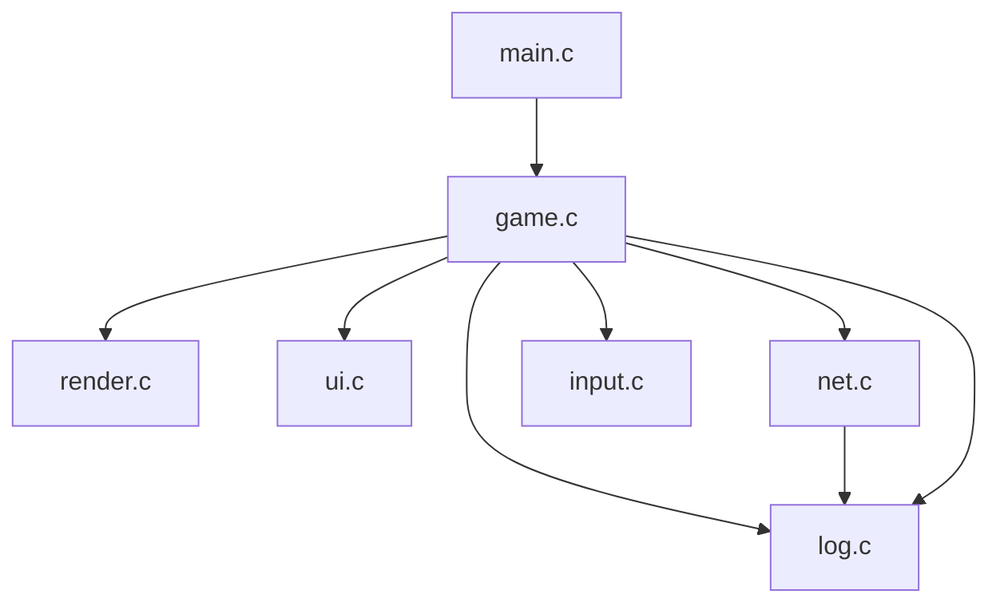

# OveNotesDS - Descargas y Estructura del Proyecto

> [!IMPORTANT]
> ### 🚀 ENLACES DE DESCARGA DIRECTA (ÚLTIMA VERSIÓN)
> Descarga la versión compilada y lista para usar en tus dispositivos:
> 
> * **🎮 Nintendo DS / DSi (ROM Homebrew):** [Descargar OveNotesDs.nds](https://github.com/JoelBeja2000/OveNotesDs/releases/latest/download/OveNotesDs.nds)
> * **📱 Android (Aplicación Móvil):** [Descargar OveNotesDS.apk](https://github.com/JoelBeja2000/OveNotesDs/releases/latest/download/OveNotesDS.apk)
> * **💻 Windows (Ejecutable de Escritorio):** [Descargar OveNotesDS.exe](https://github.com/JoelBeja2000/OveNotesDs/releases/latest/download/OveNotesDS.exe)

---

Este documento describe detalladamente la estructura del código, los sistemas principales y el flujo de ejecución de **OveNotesDS**, una aplicación homebrew para Nintendo DS desarrollada con el SDK **BlocksDS**. Su propósito principal es permitir al usuario realizar dibujos en la pantalla táctil y subirlos como imágenes PNG a un servidor HTTP mediante peticiones HTTP POST (`/api/nueva-nota`).

---

## 🛠️ Entorno de Desarrollo y Herramientas

*   **SDK**: BlocksDS (Core).
*   **Lenguaje**: C (ARM9).
*   **Librerías principales**:
    *   `libnds9`: Control del hardware de Nintendo DS (pantallas, VRAM, entradas de botones y panel táctil).
    *   `libdswifi9` (`dswifi`): Inicialización y manejo de la tarjeta de red Wi-Fi.
    *   `lodepng`: Codificador PNG en C para transformar el búfer de dibujo en una imagen comprimida antes de subirla.

---

## 📂 Estructura del Código Fuente (`/source`)

El código está estructurado en módulos independientes encargados de lógica de juego, red, interfaz y renderizado:

### 1. `main.c` (Punto de Entrada)
*   **Función**: Inicializa el manejador de excepciones del hardware, inicia las pantallas y carga la tarjeta SD mediante `fatInitDefault()`.
*   **Flujo**:
    1. Llama a `gameInit()` para configurar la VRAM y modos de vídeo de la DS.
    2. Si se monta la SD correctamente, inicializa el sistema de logs con `logInit()` y carga la última configuración guardada con `netLoadConfig()`.
    3. Entra en el bucle principal infinito, ejecutando `inputScan()`, `gameUpdate()` y esperando la sincronización vertical (`swiWaitForVBlank()`) a 60 FPS.

### 2. `game.c` y `game.h` (Máquina de Estados de la Aplicación)
*   **Estados de `GameState`**:
    *   `STATE_DRAW`: Pantalla principal donde se dibuja. Muestra el lienzo y la barra de herramientas.
    *   `STATE_WIZARD`: Formulario de configuración de IP, puerto y SSID de Wi-Fi con teclado virtual en pantalla.
    *   `STATE_UPLOAD`: Codifica el lienzo a PNG en memoria intermedia RAM (`lodepng`) y realiza la subida de datos HTTP POST a través de sockets TCP de red.
*   **`gameUpdate()`**: Dirige la lectura del panel táctil y distribuye eventos basándose en el estado activo actual.
*   **Gestión Táctil Robusta**: Implementa lógica basada en la **liberación de pulsación (release)** para evitar lecturas ruidosas de coordenadas `0,0` iniciales del digitalizador ADC de Nintendo DS (evitando que se pulsen botones por error al iniciar un toque).

### 3. `net.c` y `net.h` (Comunicaciones y Sockets)
*   **Red Clásica DS vs DSi**: Utiliza `Wifi_InitDefault(WIFI_ATTEMPT_DSI_MODE)`. Intenta usar el hardware DSi (permitiendo redes WPA/WPA2 modernas configuradas en ranuras 4-6). En DS clásica, cae a redes WEP o Abiertas sin seguridad (ranuras 1-3).
*   **`enviarNotaHTTP()`**:
    *   Crea un socket TCP bloqueante (`AF_INET`, `SOCK_STREAM`).
    *   Conecta al servidor remoto especificado.
    *   Construye cabeceras HTTP POST estándar (`Content-Type: application/octet-stream`, `Content-Length`).
    *   Envía de forma segura los búferes binarios usando sockets no bloqueantes y `select()` para gestionar tiempos de espera (timeout) y evitar cuelgues eternos de red.
*   **Persistencia de datos**:
    *   `netLoadConfig()`: Lee de la raíz de la SD `ovenotes_config.txt` y parsea los valores de IP, Puerto y SSID.
    *   `netSaveConfig()`: Escribe estos tres campos de texto línea por línea para persistir tras apagados de consola.

### 4. `ui.c` y `ui.h` (Interfaz Gráfica y Formularios)
*   **`uiDrawToolbar()`**: Dibuja en la parte inferior de la pantalla la barra de herramientas táctiles: pinceles (tamaños 1, 3, 5), borrador (BORR), CONFIG y PUBLICAR.
*   **`uiDrawFormUI()`**: Rinde todo el panel del configurador de red con soporte visual de cajas de entrada de texto seleccionables mediante pestañas en la pantalla superior y el teclado en la pantalla inferior.

### 5. `render.c` y `render.h` (Dibujo y Gráficos)
*   **Motor Gráfico**: Dibuja primitivas directo en la VRAM de la pantalla de dibujo (`canvas_buffer`).
*   **Funciones**: Implementa dibujo de píxeles, dibujo de líneas continuas por interpolación (para evitar trazos punteados debido a tasas de muestreo en trazos rápidos) y búferes de previsualización a escala de 128x128 píxeles en la pantalla superior.

### 6. `input.c` y `input.h` (Lectura del Hardware)
*   Abstracción simple para envolver las llamadas estándar de lectura de teclas pulsadas, mantenidas y lectura del digitalizador de la pantalla táctil de la DS.

### 7. `log.c` y `log.h` (Archivo de Logs en la SD)
*   Reescribe la macro estándar de `printf` a `logPrintf` (siempre que se incluya `log.h`).
*   Escribe toda traza de depuración en la consola y de forma inmediata en el archivo `sd:/debug_log.txt` (forzando actualización de la estructura FAT con `fflush` y `fsync`), permitiendo al desarrollador revisar errores y caídas leyendo el log desde su PC.

---

## ⚠️ Puntos Críticos para Futuras Correcciones de Errores

1.  **Crashes de Red (Punteros Nulos)**:
    *   *Detalle*: `Wifi_DisconnectAP()` crasheará si se invoca antes de `Wifi_InitDefault()`.
    *   *Solución*: Se ha protegido con un booleano global `wifi_inicializado`. Cualquier función de red debe comprobar este estado antes de interactuar con el chip.
2.  **Lecturas Táctiles Ruinosas (ADC Touch Noise)**:
    *   *Detalle*: El primer frame de contacto táctil (`keysDown() & KEY_TOUCH`) suele devolver las coordenadas `0,0` debido a la estabilización de los voltajes del ADC.
    *   *Solución*: Registrar las pulsaciones de menús y botones al soltar el lápiz óptico (`keysHeld()` no contiene la tecla táctil, pero en el frame anterior sí), utilizando la variable de coordenada previamente leída en el frame de retención final.
3.  **Memoria RAM Limitada**:
    *   *Detalle*: La Nintendo DS tiene 4MB de memoria RAM principal (modo DS) o 16MB (modo DSi).
    *   *Solución*: El guardado temporal del dibujo (`backup_canvas`, `backup_preview`) e imágenes PNG comprimidas dinámicas se reserva con `malloc` y se libera de inmediato con `free`. Asegurarse de liberar recursos de memoria tras codificar PNGs o salir de los estados del asistente de red.
4.  **Sockets Bloqueantes**:
    *   *Detalle*: Los sockets estándar de dswifi pueden congelar el bucle principal si el servidor HTTP remoto no responde o la red se pierde a mitad de la subida.
    *   *Solución*: Utilizar sockets no-bloqueantes temporales empleando la llamada de sistema `select()` con un timeout estricto de pocos segundos (implementado en `send_all_timeout` y `recv_timeout`).
